# Agies AI — System Architecture

[](https://open-metadata.org)
[](https://aws.amazon.com)
[](https://fastapi.tiangolo.com)
[](https://github.com/facebookresearch/faiss)

> Full architecture reference for Agies AI — the AI-powered PII governance engine built on OpenMetadata.
> Part of the **WeMakeDevs × OpenMetadata OUTATIME Hackathon 2026** submission.

---

## Table of Contents

- [System Overview](#system-overview)
- [High-Level Architecture](#high-level-architecture)
- [AWS Deployment Architecture](#aws-deployment-architecture)
- [Backend Engine Architecture](#backend-engine-architecture)
- [3-Layer PII Scanner](#3-layer-pii-scanner)
- [11-Ring Governance Pipeline](#11-ring-governance-pipeline)
- [OpenMetadata Integration Layer](#openmetadata-integration-layer)
- [MCP Server Architecture](#mcp-server-architecture)
- [Frontend Architecture](#frontend-architecture)
- [Data Flow Diagrams](#data-flow-diagrams)
- [Database Schema](#database-schema)
- [Security Architecture](#security-architecture)

---

## System Overview

Agies AI is a three-tier system:

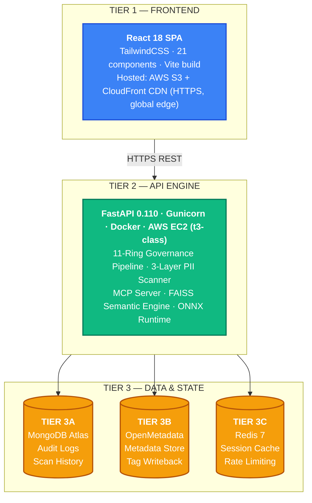

---

## High-Level Architecture

```mermaid
flowchart TD
    subgraph Platform["AGIES AI PLATFORM"]
        direction TB
        
        subgraph UI["Frontend Layer"]
            F1["Governance Chat UI<br/>(React Frontend)"]
            F2["CatalogPanel UI"]
        end
        
        subgraph Pipeline["11-Ring Governance Pipeline"]
            P1["<b>Ring 1-4:</b><br/>Intent + Entity + Policy Match"]
            P2["<b>Ring 5-8:</b><br/>Risk Score + Regulation + Explanation"]
            P3["<b>Ring 9-11:</b><br/>LLM Analysis + Decision + Audit Log"]
            P1 --> P2 --> P3
        end
        
        subgraph Ext["External Integration"]
            direction LR
            DB1[("MongoDB Atlas<br/>(Audit + Scans)")]
            LLM["Groq LLM API<br/>(LLaMA 4 Scout)"]
            Cache[("Redis Cache<br/>(Session Data)")]
        end
        
        subgraph Catalog["Catalog Governance Flow"]
            OM["OpenMetadata REST API<br/>/api/v1/tables"]
            S1["3-Layer PII Scanner"]
            FAISS["FAISS Semantic Engine<br/>(ONNX all-MiniLM-L6-v2)"]
            T1["om_tagger"]
            C1["om_compliance<br/>report generator"]
        end
    end
    
    U1["Data Analyst<br/>/ Developer<br/>/ AI Agent"]
    
    U1 -- '"Show Aadhaar numbers"' --> F1
    F1 -- 'BLOCKED · Risk: 90' --> U1
    
    F1 -- "POST /api/analyze" --> Pipeline
    P3 --> DB1
    P3 --> LLM
    P3 --> Cache
    
    F2 -- "GET /api/om/catalog" --> OM
    F2 -- "POST /api/om/scan/all" --> S1
    S1 -- "Embeddings" --> FAISS
    S1 -- "Scan Results" --> T1
    T1 -- "OpenMetadata PATCH tags" --> OM
    F2 -- "GET /api/om/compliance" --> C1
    
    classDef user fill:#6366f1,stroke:#4338ca,stroke-width:2px,color:#fff;
    classDef frontend fill:#3b82f6,stroke:#1d4ed8,stroke-width:2px,color:#fff;
    classDef pipeline fill:#10b981,stroke:#047857,stroke-width:2px,color:#fff;
    classDef ext fill:#f59e0b,stroke:#b45309,stroke-width:2px,color:#fff;
    classDef module fill:#8b5cf6,stroke:#6d28d9,stroke-width:2px,color:#fff;
    classDef platform fill:#0f172a,stroke:#334155,stroke-width:2px,color:#fff;
    
    class U1 user;
    class F1,F2 frontend;
    class P1,P2,P3 pipeline;
    class DB1,LLM,Cache ext;
    class OM,S1,FAISS,T1,C1 module;
    class Platform platform;
```

---

## AWS Deployment Architecture

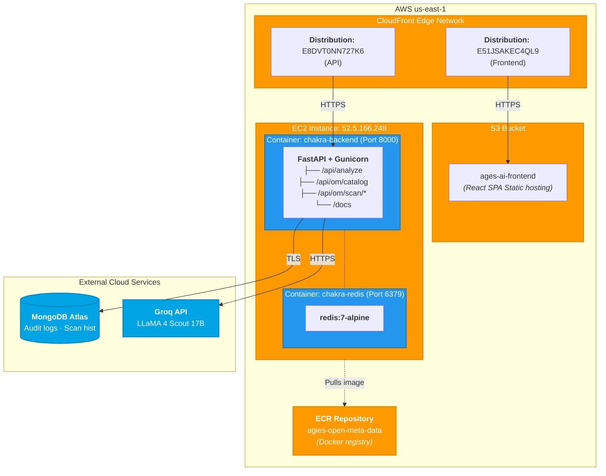

### Deployment Pipeline

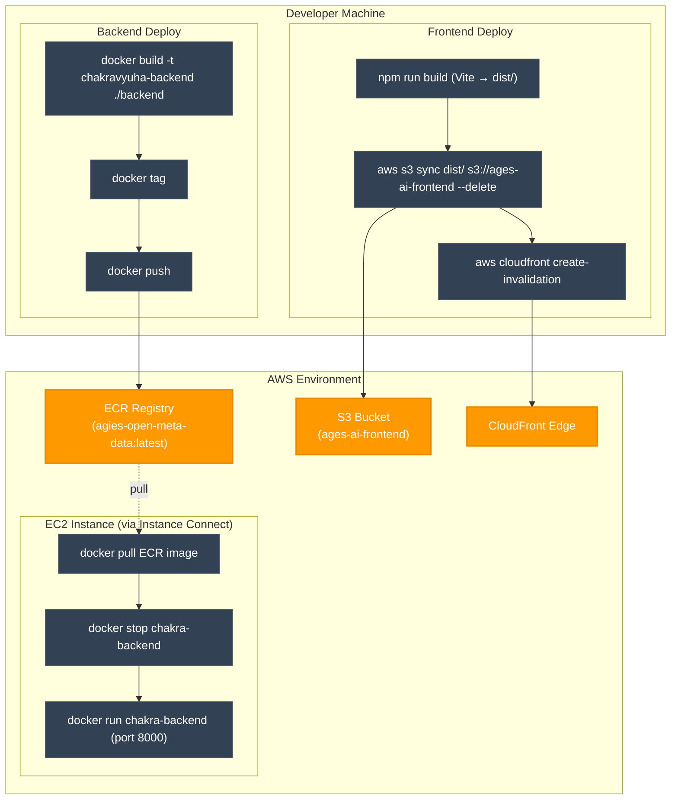

---

## Backend Engine Architecture

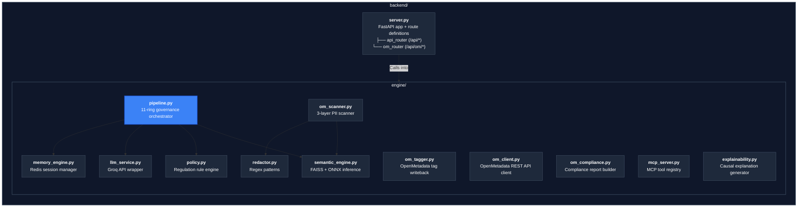

---

## 3-Layer PII Scanner

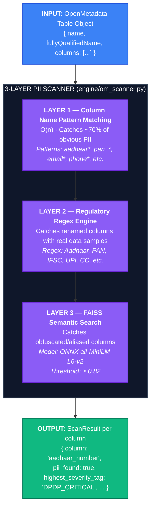

---

## 11-Ring Governance Pipeline

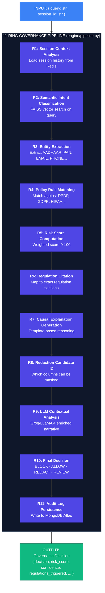

---

## OpenMetadata Integration Layer

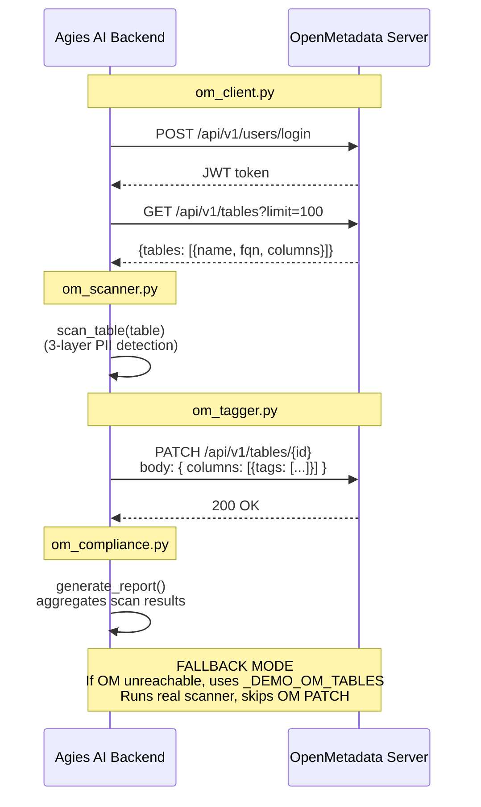

---

## MCP Server Architecture

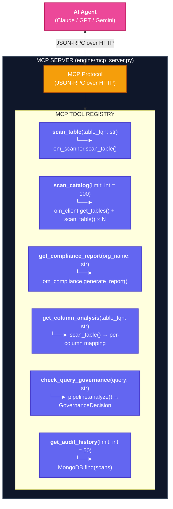

---

## Frontend Architecture

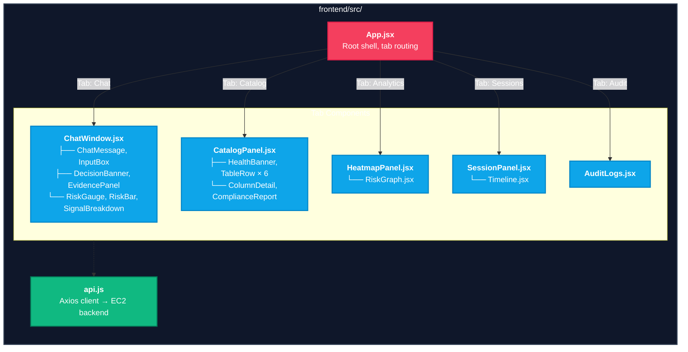

---

## Data Flow Diagrams

### Query Governance Flow

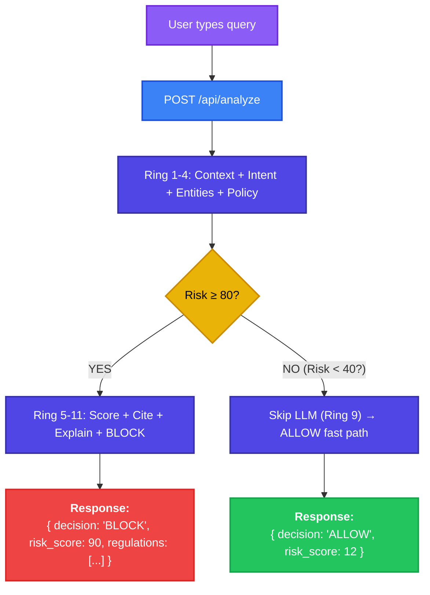

### Catalog Scan Flow

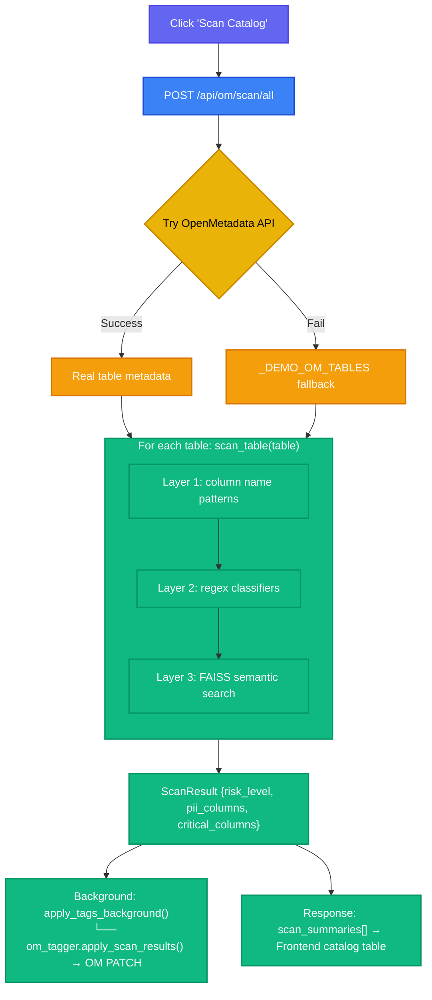

---

## Database Schema

### MongoDB — `governance_logs` database

**Collection: `audit_logs`**
```json
{
  "_id": "ObjectId",
  "query": "Show me all Aadhaar numbers...",
  "session_id": "default",
  "decision": "BLOCK",
  "risk_score": 90,
  "confidence": 0.94,
  "regulations_triggered": ["DPDP_2023"],
  "pii_entities": ["AADHAAR"],
  "explanation": "...",
  "timestamp": "2026-04-25T10:30:00Z",
  "processing_time_ms": 234
}
```

**Collection: `scan_history`**
```json
{
  "_id": "ObjectId",
  "table_fqn": "fintech_demo_db.fintech_prod.public.users",
  "table_name": "users",
  "risk_level": "CRITICAL",
  "pii_columns": 5,
  "critical_columns": 2,
  "regulations_triggered": ["DPDP_2023", "GDPR", "HIPAA"],
  "column_results": [...],
  "scanned_at": "2026-04-25T10:30:00Z",
  "tagged_at": "2026-04-25T10:30:01Z"
}
```

---

## Security Architecture

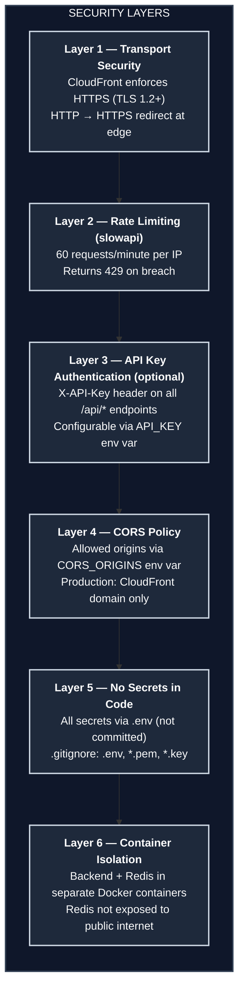

---

*Agies AI Architecture v3 · WeMakeDevs × OpenMetadata OUTATIME 2026 · [Back to README](../README.md)*
