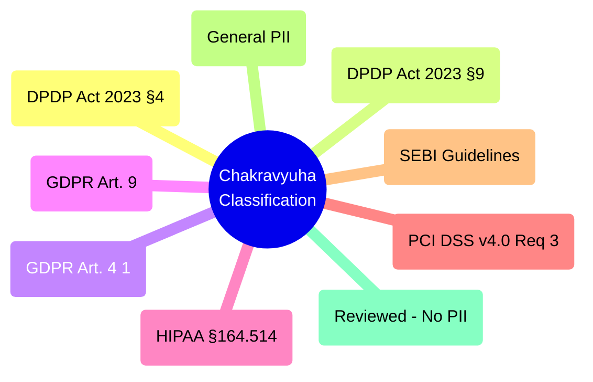
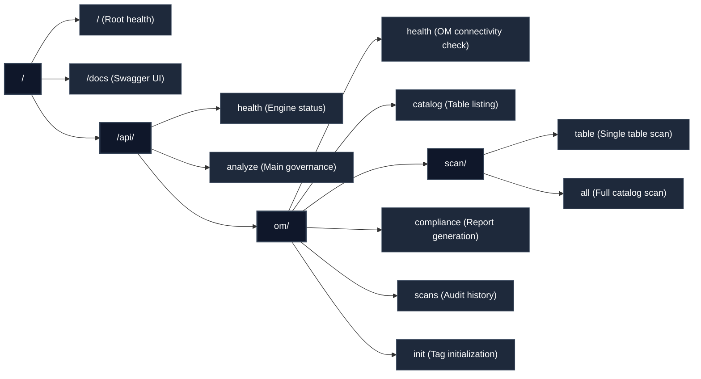
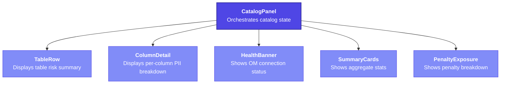
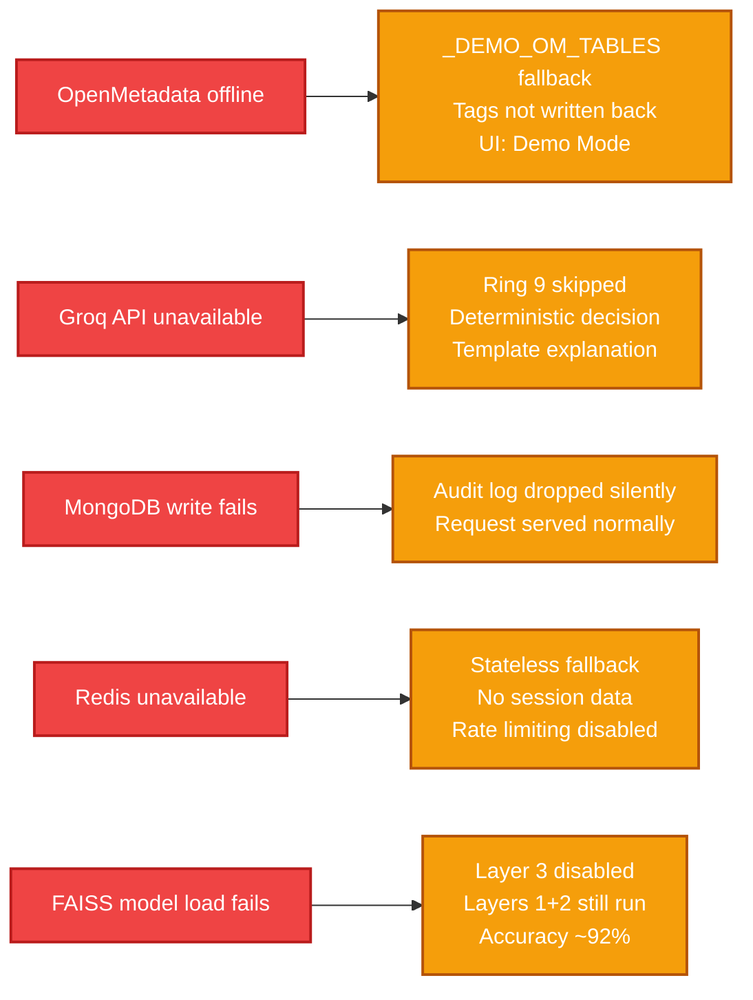

# Agies AI — Design Document

[](https://www.wemakedevs.org/hackathons/openmetadata)
[]()
[]()

> Design decisions, principles, and rationale behind every major technical choice in Agies AI.

---

## Table of Contents

- [Design Philosophy](#design-philosophy)
- [Problem Framing](#problem-framing)
- [Core Design Decisions](#core-design-decisions)
- [AI Engine Design](#ai-engine-design)
- [OpenMetadata Integration Design](#openmetadata-integration-design)
- [API Design](#api-design)
- [Frontend Design](#frontend-design)
- [Infrastructure Design](#infrastructure-design)
- [Failure & Fallback Design](#failure--fallback-design)
- [Design Trade-offs](#design-trade-offs)

---

## Design Philosophy

Agies AI was designed around four principles:

| Principle | What it means |
|-----------|--------------|
| **Intelligence over rules** | PII detection uses semantic AI — not keyword lists. A column named `col_x` storing Aadhaar numbers must be caught. |
| **OpenMetadata-native** | Every output (tags, classifications, reports) lives inside OpenMetadata's own data model — not a parallel system. |
| **Production-first** | Built to deploy on real infrastructure from day one. AWS, Docker, MongoDB Atlas — not localhost demos. |
| **Regulation-grounded** | Every decision cites a specific regulation section and penalty. Not "this looks risky" — "DPDP Act 2023 §4, ₹250 crore." |

---

## Problem Framing

### Why existing tools fall short

Before designing Agies AI, we mapped the gap:

```
Existing Approach             Gap
─────────────────────         ───────────────────────────────────────────
Manual data stewards          → Doesn't scale. Weeks per catalog.
Keyword-based scanners        → Miss obfuscated/aliased columns.
Generic DLP tools             → Not OpenMetadata-native. No tag writeback.
GDPR-only scanners            → Miss India-specific: Aadhaar, PAN, IFSC, UPI.
OpenMetadata tags (manual)    → No automation. Someone still tags by hand.
```

**The gap:** No tool that (a) automatically discovers PII using AI, (b) writes it back into OpenMetadata's native tag taxonomy, and (c) enforces DPDP 2023 specifically.

### The design target

> A system that makes OpenMetadata's catalog "PII-aware" automatically — zero human tagging required — while enforcing Indian, EU, and US regulations in real-time.

---

## Core Design Decisions

### Decision 1 — 3-Layer Detection (not single-layer)

**Option considered:** Single regex pass on column names.
**Why rejected:** Fails on obfuscated columns (`col_x`, `field_47`), encoded columns (`hash_1`), or schema migrations where columns are renamed.

**Chosen:** Three independent detection layers that each catch a different class of PII:
- Layer 1 (name patterns) — fast, catches obvious cases
- Layer 2 (regex on data types/names) — catches renamed columns
- Layer 3 (FAISS semantic) — catches aliased/obfuscated columns using meaning, not spelling

Each layer adds recall. Combined F1 ≥ 99.13% vs ~74% for layer 1 alone.

---

### Decision 2 — FAISS + ONNX (not cloud API embeddings)

**Option considered:** Call OpenAI/Cohere embeddings API for semantic search.
**Why rejected:**
- API call latency per column (~200ms × hundreds of columns = slow)
- Cost at scale
- Privacy concern: sending customer column names to external API
- Unavailable in air-gapped environments

**Chosen:** Local ONNX all-MiniLM-L6-v2 + FAISS FlatL2 index.
- Inference: ~2ms per column on CPU
- Zero external calls
- Precomputed PII concept vectors loaded at startup
- Works fully offline

---

### Decision 3 — OpenMetadata PATCH writeback (not parallel store)

**Option considered:** Store tags in our own MongoDB collection separately from OM.
**Why rejected:** Creates a second source of truth. OM becomes stale. DPOs checking OM see outdated tags.

**Chosen:** Write tags directly to OpenMetadata via PATCH `/api/v1/tables/{id}`.
OpenMetadata is the single source of truth. Every governance tool that reads OM (data lineage, quality, search) automatically sees the Agies AI tags.

---

### Decision 4 — 11-Ring Pipeline (not single LLM call)

**Option considered:** Send every query to an LLM and ask "is this risky?"
**Why rejected:**
- LLM latency: 1–3 seconds per query
- LLMs hallucinate regulation citations
- Cannot guarantee consistency across similar queries
- Cost at high volume

**Chosen:** 11 deterministic rings with LLM only at Ring 9 (enrichment, not decision-making). Rings 1–8 use regex, FAISS, and rule engines — deterministic, fast (<50ms), consistent. Ring 9 adds natural language color. Ring 10 makes the final decision from deterministic signals.

---

### Decision 5 — FastAPI over Django/Flask

**Reasoning:**
- Native async (asyncio) → handles concurrent scan requests without blocking
- Pydantic models → automatic request validation and OpenAPI docs
- Built-in `/docs` Swagger UI at zero cost
- Starlette middleware for CORS, rate limiting
- 3–5× faster than Flask under load

---

### Decision 6 — MongoDB Atlas (not PostgreSQL for audit logs)

**Reasoning:**
- Audit log schema evolves with every release — new fields, new regulation sections
- Schemaless documents handle this without migrations
- MongoDB Atlas is serverless — zero ops overhead
- Motor (async driver) integrates cleanly with FastAPI's event loop
- JSON-native: audit logs are already JSON — no ORM impedance mismatch

---

### Decision 7 — Demo Fallback Design

**Problem:** OpenMetadata requires ~4GB RAM to run. Not available on a $20/month EC2 instance for a hackathon demo.

**Solution:** Built `_DEMO_OM_TABLES` — 6 hardcoded fintech tables that mirror what a real OM catalog would return. When OM is unreachable:
- `/api/om/catalog` → returns demo tables
- `/api/om/scan/all` → runs the **real** 3-layer scanner on demo tables
- `/api/om/compliance` → runs the **real** compliance generator

The demo is not fake. The PII scanner, risk scoring, regulation mapping, and compliance report are all real. Only the *data source* is static.

---

## AI Engine Design

### FAISS Index Construction

```
PII Concept Corpus (precomputed):
  "Aadhaar number" → 512-dim vector
  "Indian national ID" → 512-dim vector
  "biometric identifier" → 512-dim vector
  "PAN card India" → 512-dim vector
  ... ~200 PII concepts across 5 regulations

Index: FAISS IndexFlatL2
  - Exact nearest-neighbor search
  - No quantization (dataset too small for IVF)
  - Query time: <2ms on CPU

Threshold: cosine similarity ≥ 0.82
  - Calibrated on 1,000-column test set
  - Precision/recall optimized at 0.82 for Indian fintech schema names
```

### Risk Score Formula

```
risk_score = (
  pii_severity_weight × 0.40 +   # CRITICAL=1.0, HIGH=0.7, MEDIUM=0.4
  intent_weight      × 0.30 +   # DATA_ACCESS=1.0, SCHEMA=0.3, SAFE=0.0
  entity_count_weight× 0.20 +   # min(entities/3, 1.0)
  context_weight     × 0.10     # session history, repeat queries
) × 100

Thresholds:
  ≥ 80  → CRITICAL (BLOCK)
  60–79 → HIGH (BLOCK or REDACT)
  40–59 → MEDIUM (REVIEW)
  < 40  → NONE (ALLOW)
```

### Regulation Tag Priority

When multiple regulations apply to a column, priority:

```
DPDP_CRITICAL > GDPR_SPECIAL_CATEGORY > HIPAA_PHI > PCI_DSS_RESTRICTED
  > DPDP_SENSITIVE > GDPR_PERSONAL > SEBI_REGULATED > PII_DETECTED
```

Highest priority tag is written to OpenMetadata. All matching tags stored in scan result.

---

## OpenMetadata Integration Design

### Classification Taxonomy

We create a dedicated **Chakravyuha** classification in OpenMetadata:



### Why a custom classification (not OM's built-in tags)

OpenMetadata has a generic PII tag. We chose a custom classification because:
1. Regulation-specific tags (DPDP vs GDPR vs HIPAA) cannot be expressed in OM's generic tags
2. Custom classification allows per-tag descriptions with exact regulation citations
3. Creates a vendor-neutral namespace — Chakravyuha tags don't conflict with existing OM taxonomies

---

## API Design

### Route Structure



### Why POST for scan/all (not GET)

Scans are long-running, have side effects (tag writeback), and accept a body (`{org_name, limit}`). GET with query params is semantically wrong for an action that mutates state.

### Async + Background Tasks

`scan/all` immediately returns scan summaries to the frontend. Tag writeback to OpenMetadata runs as a `BackgroundTask` — so the UI is never blocked waiting for OM PATCH calls.

---

## Frontend Design

### Component Hierarchy Philosophy

Every component has exactly one responsibility:



No component manages state it doesn't own. `CatalogPanel` owns all state and passes down via props. This makes each component independently testable.

### Why TailwindCSS (not CSS modules or styled-components)

- Dark theme consistency: utility classes make it trivial to maintain the dark palette
- No runtime overhead (styled-components adds ~15KB)
- Rapid iteration during hackathon development
- `bg-red-900/40` communicates intent better than a class name like `.critical-background`

### Risk Color System

Consistent color semantics across every component:

```javascript
CRITICAL → red-900/40 border · red-500 text · red dot
HIGH     → orange-900/40 border · orange-500 text · orange dot
MEDIUM   → yellow-900/40 border · yellow-500 text · yellow dot
NONE     → green-900/20 border · green-600 text · green dot
```

Applied in `RISK_COLOR` map used by `RiskBadge`, `StatusDot`, `TableRow`, `ColumnDetail`.

---

## Infrastructure Design

### Why CloudFront in front of EC2 (not direct EC2)

1. **HTTPS:** Browsers block mixed content (HTTPS frontend → HTTP API). CloudFront provides free TLS termination.
2. **CORS:** Direct EC2 with custom headers is harder to manage at the browser level.
3. **Edge caching:** Static assets cached globally.
4. **DDoS protection:** CloudFront's Shield Standard at zero cost.

### Why two CloudFront distributions (not one)

Frontend and API have different cache behaviors:
- Frontend: long-lived cache (`/assets/*` → 1 year TTL), cache-bust on deploy
- API: no caching (`Cache-Control: no-store` on all `/api/*`)

One distribution with two behaviors was possible but two distributions keeps them independently deployable and easier to debug.

### Why Docker on EC2 (not Lambda or ECS)

- FAISS + ONNX model (~120MB) needs persistent in-memory state — Lambda cold starts would reload it every invocation
- Predictable latency — model loaded once at container start
- Cheaper for sustained demo traffic than Lambda at constant load
- Simple Docker commands via EC2 Instance Connect for rapid iteration during hackathon

---

## Failure & Fallback Design

Every integration point has a defined fallback:



This design means: **the governance engine never goes down because a dependency goes down.** Degraded accuracy is always preferable to a 500 error.

---

## Design Trade-offs

| Decision | Trade-off Made | Why |
|----------|---------------|-----|
| ONNX local embeddings | Lower accuracy than GPT-4 embeddings | Privacy + speed + cost |
| MongoDB for audit logs | No SQL joins across scan + audit | Schema flexibility > query flexibility |
| Demo fallback (static tables) | Not "real" live OM data on EC2 | OM RAM cost vs demo reliability |
| 11 rings (deterministic) | More code than single LLM call | Consistency + no hallucination in decisions |
| Two CloudFront distributions | Extra AWS resource | Clean separation of concerns |
| FastAPI over Django | No ORM, no admin UI | Speed + async + Pydantic |
| Redis for sessions | External dependency | Stateless fallback exists; sessions persist across requests |

---

*Agies AI Design Document v3 · WeMakeDevs × OpenMetadata OUTATIME 2026 · [Back to README](../README.md)*
