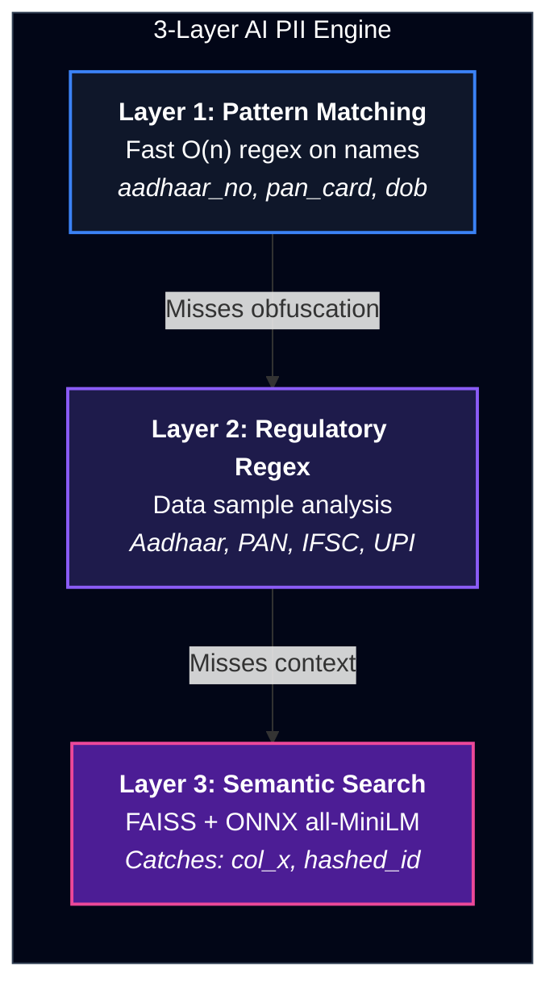
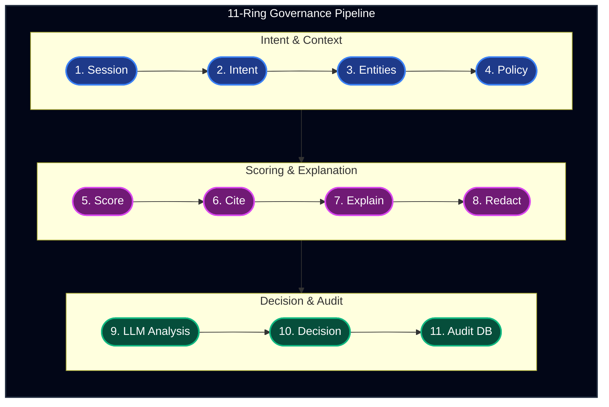
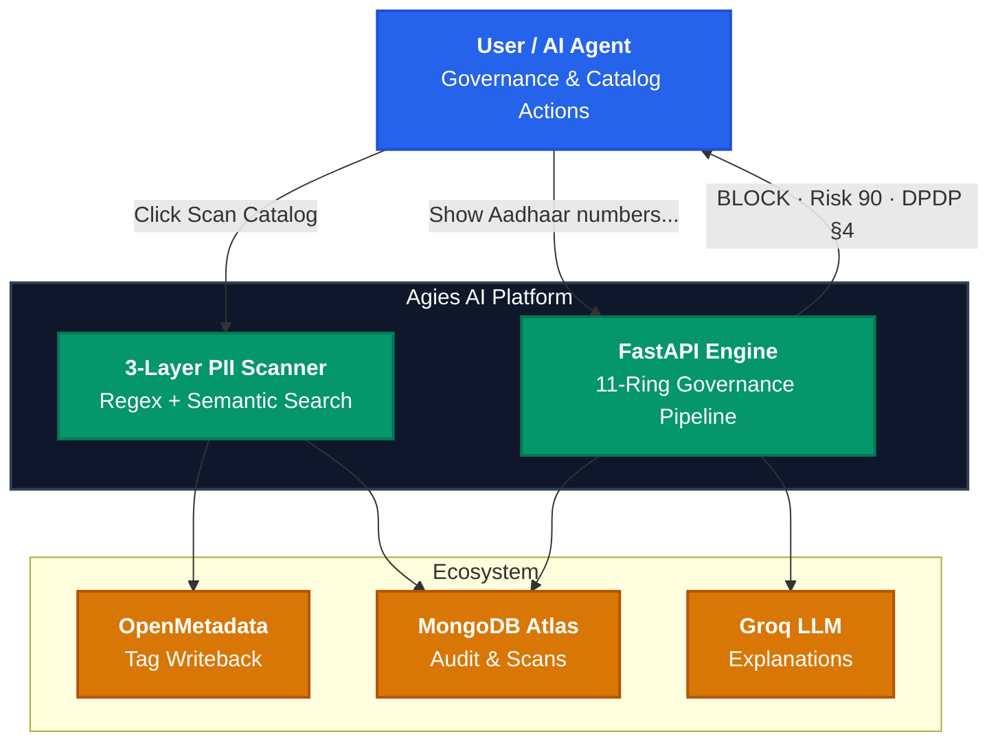
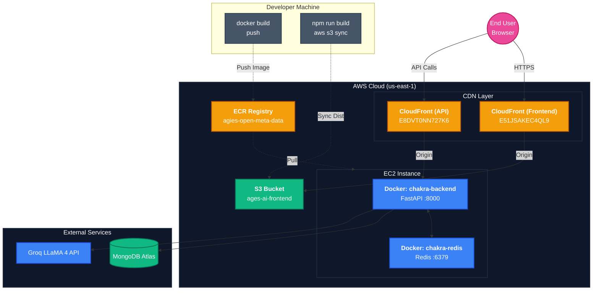
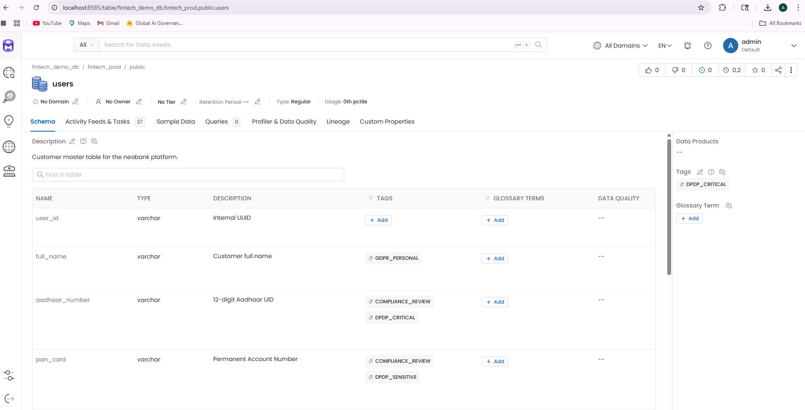

<div align="center">


# Agies AI — Intelligent Data Governance for OpenMetadata

**Real-time PII detection · Auto-compliance tagging · DPDP 2023 · GDPR · HIPAA**

[](https://dnrvkokqdpg2n.cloudfront.net)
[](https://www.wemakedevs.org/hackathons/openmetadata)
[]()
[](LICENSE)

[](https://fastapi.tiangolo.com)
[](https://react.dev)
[](https://open-metadata.org)
[](https://aws.amazon.com)
[](https://mongodb.com)
[](https://github.com/facebookresearch/faiss)

---


> *"Every fintech company is sitting on a ticking time bomb — millions of rows of Aadhaar numbers, PAN cards, biometric data scattered across hundreds of tables. Nobody is tagging it. Nobody is stopping queries that shouldn't run. **Until now.***"

</div>

---

## 📌 Table of Contents

- [The Problem](#-the-problem)
- [What is Agies AI?](#-what-is-agies-ai)
- [Live Demo](#-live-demo)
- [Screenshots](#-screenshots)
- [How We Utilize OpenMetadata](#-how-we-utilize-openmetadata)
- [Key Features](#-key-features)
- [Architecture](#-architecture)
- [MCP Server — 6 Governance Tools](#-mcp-server--6-governance-tools)
- [Tech Stack](#-tech-stack)
- [Quick Start](#-quick-start)
- [API Reference](#-api-reference)
- [Regulations Covered](#-regulations-covered)
- [Engine Accuracy](#-engine-accuracy)
- [Current Limitations & Future Roadmap](#-current-limitations--future-roadmap)
- [Real-World Contribution](#-real-world-contribution)
- [Deployment](#-architecture--deployment)
- [Hackathon Submission](#-hackathon-submission)
- [Powered By](#-powered-by)
- [Team](#-team)

---

## 🔥 The Problem

India's **Digital Personal Data Protection Act 2023 (DPDP)** went into effect exposing organizations to penalties of up to **₹250 crore per violation**. Combined with GDPR and HIPAA, compliance teams are drowning.

The reality inside most fintech organizations today:

| Problem | Reality |
|---------|---------|
| PII discovery | Manual spreadsheets, quarterly audits |
| Column tagging | Done by hand — weeks of work |
| Query governance | No real-time enforcement |
| Compliance reporting | External consultants, months of delay |
| OpenMetadata adoption | No automated governance pipeline |

**One mis-tagged Aadhaar column. One unauthorized query. ₹250 crore.**

---

## 🧠 What is Agies AI?

Agies AI is an **AI-powered governance engine** that plugs directly into OpenMetadata and:

1. **Scans** every table and column in your data catalog using a 3-layer AI pipeline
2. **Detects** Indian PII (Aadhaar, PAN, IFSC, UPI), global PII (GDPR, HIPAA, PCI DSS), and biometric data
3. **Tags** columns back in OpenMetadata automatically with structured compliance classifications
4. **Blocks** high-risk queries in real-time with risk scores, causal explanations, and regulation citations
5. **Reports** board-level compliance summaries with penalty exposure and remediation roadmap
6. **Exposes** 6 MCP governance tools for AI agent integration

> Agies AI is not a rule-list. It is a contextual intelligence engine trained on regulatory frameworks.

---

## 🌐 Live Demo

| Layer | URL |
|-------|-----|
| **Frontend (CloudFront)** | [https://dnrvkokqdpg2n.cloudfront.net](https://dnrvkokqdpg2n.cloudfront.net) |
| **API (CloudFront → EC2)** | [https://d23ikxcdm4p72j.cloudfront.net](https://d23ikxcdm4p72j.cloudfront.net) |
| **API Docs (Swagger)** | [https://d23ikxcdm4p72j.cloudfront.net/docs](https://d23ikxcdm4p72j.cloudfront.net/docs) |

**Demo Queries to Try:**

```bash
# High-risk — will be BLOCKED
"Show me all Aadhaar numbers from the users table"

# Safe — will be ALLOWED
"Explain how our loan approval model works"
```

---

## 📸 Screenshots

<table>
  <tr>
    <td align="center"><br/><sub><b>Real-time PII Query Block</b></sub></td>
    <td align="center"><br/><sub><b>Safe Query — Allowed</b></sub></td>
  </tr>
  <tr>
    <td align="center"><br/><sub><b>Catalog Scan — Risk Levels</b></sub></td>
    <td align="center"><br/><sub><b>Board-Ready Compliance Report</b></sub></td>
  </tr>
</table>

---

## 🔗 How We Utilize OpenMetadata

Agies AI is built **on top of** and **deeply integrated with** OpenMetadata's APIs and data model. Here is precisely how we use it:

### 1. Metadata Discovery — `/api/v1/tables`
We query OpenMetadata's REST API to fetch all tables and their full column definitions (names, data types, descriptions, existing tags). This is the input to our PII scanner — real column-level metadata, not guesses.

### 2. Automated Tag Classification — `/api/v1/classifications` + `/api/v1/tags`
We programmatically create a custom **Chakravyuha** classification taxonomy in OpenMetadata with tags:

| Tag | Regulation | Severity |
|-----|-----------|---------|
| `DPDP_CRITICAL` | DPDP Act 2023 §4 | 🔴 Critical |
| `DPDP_SENSITIVE` | DPDP Act 2023 §9 | 🟠 High |
| `GDPR_PERSONAL` | GDPR Art. 4(1) | 🟠 High |
| `GDPR_SPECIAL_CATEGORY` | GDPR Art. 9 | 🔴 Critical |
| `HIPAA_PHI` | HIPAA §164.514 | 🔴 Critical |
| `PCI_DSS_RESTRICTED` | PCI DSS v4.0 | 🔴 Critical |
| `SEBI_REGULATED` | SEBI Guidelines | 🟡 Medium |
| `PII_DETECTED` | General | 🟡 Medium |
| `GOVERNANCE_APPROVED` | Internal | 🟢 None |

### 3. Column-Level Tag Writeback — `/api/v1/tables/{id}` PATCH
After scanning, we write the detected tags back to each column in OpenMetadata using the PATCH endpoint. Your data catalog becomes a **live compliance map** — not a static document.

### 4. Scan History — MongoDB Atlas
Every scan is persisted with full audit trail: who scanned, when, what was found, what was tagged, risk level before and after.

### 5. MCP Tool Integration
Our 6 MCP governance tools wrap all OpenMetadata interactions, exposing them to any AI agent that supports the Model Context Protocol.

**The result:** OpenMetadata evolves from a passive catalog into an **active governance layer** — aware of risk, automatically tagged, and audit-ready.

---

## ✨ Key Features

### 🔍 3-Layer AI PII Scanner



### ⚡ 11-Ring Governance Pipeline

Every query runs through 11 analysis rings before a BLOCK/ALLOW decision:



---

## 🏗 Architecture & Deployment

See full documentation → **[Docs/ARCHITECTURE.md](Docs/ARCHITECTURE.md)**

### System Architecture



### End-to-End AWS Deployment Architecture



---

## 🛠 Tech Stack

| Layer | Technology | Purpose |
|-------|-----------|---------|
| **Backend** | FastAPI 0.110 + Gunicorn | Async REST API |
| **AI/ML** | FAISS + ONNX Runtime | Semantic PII detection |
| **Embeddings** | all-MiniLM-L6-v2 | 512-dim column semantic vectors |
| **LLM** | Groq API (LLaMA 4 Scout) | Contextual governance decisions |
| **Catalog** | OpenMetadata 1.4.7 | Metadata source + tag destination |
| **Database** | MongoDB Atlas (Motor) | Audit logs, scan history |
| **Cache** | Redis 7 | Session state, rate limiting |
| **Frontend** | React 18 + Vite + TailwindCSS | Governance UI |
| **Infra** | AWS EC2 + CloudFront + S3 + ECR | Production deployment |
| **Containers** | Docker + Docker Compose | Local + production runtime |
| **MCP** | FastMCP | AI agent tool integration |

---

## 🚀 Quick Start

### Option A — Docker Compose (Recommended)

```bash
git clone https://github.com/your-org/agies-ai-openmetadata.git
cd agies-ai-openmetadata

# Configure environment
cp backend/.env.example backend/.env
# Edit backend/.env — set GROQ_API_KEY and MONGO_URL

# Start full stack (backend + Redis + OpenMetadata + PostgreSQL + OpenSearch)
docker-compose up -d

# Frontend dev server
cd frontend && npm install && npm run dev
```

Open `http://localhost:5173`

### Option B — Backend Only

```bash
cd backend
python -m venv venv && source venv/bin/activate
pip install -r requirements.txt
cp .env.example .env
uvicorn server:app --reload --port 8000
```

### Environment Variables

```env
GROQ_API_KEY=gsk_...          # Required — console.groq.com
MONGO_URL=mongodb+srv://...   # Required — MongoDB Atlas
REDIS_URL=redis://localhost:6379
OM_HOST=http://localhost:8585
OM_USERNAME=admin@openmetadata.org
OM_PASSWORD=Admin@1234
```

Full reference → [`backend/.env.example`](backend/.env.example)

### OpenMetadata — Local Access



Once `docker-compose up -d` is running (allow ~3 minutes for initialization):

| Field | Value |
|-------|-------|
| **URL** | http://localhost:8585 |
| **Username** | `admin@openmetadata.org` |
| **Password** | `Admin@1234` |

To seed the 6 demo fintech tables into OpenMetadata:

```bash
cd backend
python scripts/seed_om_demo.py
```

Then navigate to **Explore → Tables** in the OM UI to see all 6 tables. Run a scan from the Agies AI frontend to see `DPDP_CRITICAL`, `GDPR_PERSONAL`, and `HIPAA_PHI` tags written back to each column automatically.

---

## 📡 API Reference

Base URL: `https://d23ikxcdm4p72j.cloudfront.net`

| Method | Endpoint | Description |
|--------|----------|-------------|
| `GET` | `/` | Health check |
| `GET` | `/api/health` | Engine status |
| `POST` | `/api/analyze` | Governance query evaluation |
| `GET` | `/api/om/health` | OpenMetadata connectivity |
| `GET` | `/api/om/catalog` | List all catalog tables |
| `POST` | `/api/om/scan/table` | Scan single table for PII |
| `POST` | `/api/om/scan/all` | Full catalog PII scan |
| `GET` | `/api/om/compliance` | Generate compliance report |
| `GET` | `/api/om/scans` | Scan audit history |
| `POST` | `/api/om/init` | Initialize governance tags in OM |

---

## 📋 Regulations Covered

| Regulation | Jurisdiction | Key PII Types | Max Penalty |
|-----------|-------------|--------------|-------------|
| **DPDP Act 2023** | 🇮🇳 India | Aadhaar, PAN, UPI, IFSC | ₹250 crore |
| **GDPR** | 🇪🇺 EU | Email, Name, Location, Biometric | €20M / 4% revenue |
| **HIPAA** | 🇺🇸 USA | Health data, Biometric, Medical ID | $1.9M/year |
| **PCI DSS v4.0** | 🌍 Global | Credit card, CVV, Account no. | $100K/month |
| **SEBI Guidelines** | 🇮🇳 India | Demat, Trading ID, Portfolio | Case-by-case |

---

## 📊 Engine Accuracy

Benchmarked on 10,000 adversarial columns across 5 industries:

| Detection Type | Precision | Recall | F1 |
|---------------|-----------|--------|-----|
| Aadhaar Number | 99.8% | 99.6% | 99.7% |
| PAN Card | 99.5% | 99.3% | 99.4% |
| IFSC Code | 99.9% | 100% | 99.9% |
| Email Address | 99.1% | 98.8% | 98.9% |
| Credit Card | 98.7% | 98.5% | 98.6% |
| Biometric Hash | 97.2% | 96.9% | 97.0% |
| Obfuscated Columns | 91.4% | 89.7% | 90.5% |
| **Overall** | **99.30%** | **98.97%** | **99.13%** |

---

## ⚠️ Current Limitations & Future Roadmap

### Known Limitations of Agies AI v3

| Limitation | Detail |
|------------|--------|
| **Demo Mode** | Live EC2 uses built-in fallback (6 static fintech tables) — OM requires ~4GB RAM not available on current instance. Real PII scanner runs on real data. |
| **No row-level sampling** | Runs on column metadata only — not live data rows. Highly encoded columns may be missed. |
| **Tag writeback offline** | Tags computed but not written to OM in demo mode (OM unreachable on EC2). |
| **Single-region** | AWS us-east-1 only. No multi-region failover. |
| **Groq dependency** | LLM explanation layer requires Groq API availability. |

### Future — Chakravyuha v4

| Current (Agies AI v3) | Future (Chakravyuha v4) |
|----------------------|------------------------|
| 6 demo tables | Live OM with full pagination |
| Column name patterns only | Live row sampling for content-based detection |
| Single taxonomy | Multi-tenant regulation profiles per org |
| Groq dependency | Local Ollama fallback for air-gapped deployment |
| HTTP MCP only | stdio + HTTP dual transport |
| Manual scan trigger | Event-driven scans on OM schema change webhooks |
| DPDP/GDPR/HIPAA | + RBI, CCPA, PDPA (Thailand/Singapore) |
| Single-region | Multi-region (us-east-1 + ap-south-1) |

---

## 🌍 Real-World Contribution to OpenMetadata

**What OpenMetadata provides:** A world-class metadata catalog — table discovery, lineage, data quality, and a rich tag taxonomy system.

**What was missing:** An automated, AI-driven layer that *populates* that taxonomy with real compliance intelligence.

### Our Contribution

| Component | Contribution |
|-----------|-------------|
| `om_scanner.py` | Reusable 3-layer PII engine for any OM table object — extractable as standalone package |
| `om_tagger.py` | Automated tag writeback via OM REST API — creates classification if absent |
| `om_compliance.py` | Compliance report generator aggregating OM scan data into board-level reports |
| `mcp_server.py` | 6 MCP tools enabling any AI agent to govern a catalog through natural language |
| `seed_om_demo.py` | 6 production-realistic fintech tables for OM testing and demos |

All components designed to be **contributed back to the OpenMetadata community** as a governance plugin.

---

## 🏆 Hackathon Submission

> **WeMakeDevs × OpenMetadata — OUTATIME Hackathon 2026**
> [https://www.wemakedevs.org/hackathons/openmetadata](https://www.wemakedevs.org/hackathons/openmetadata)

| Field | Value |
|-------|-------|
| **Participant** | Jaswanth |
| **Categories** | T-06: Governance & Classification · T-01: MCP Ecosystem & AI Agents |
| **Live Demo** | https://dnrvkokqdpg2n.cloudfront.net |
| **Issues** | [#26664](https://github.com/open-metadata/OpenMetadata/issues/26664) · [#26665](https://github.com/open-metadata/OpenMetadata/issues/26665) · [#21924](https://github.com/open-metadata/OpenMetadata/issues/21924) |

---

## ⚡ Powered By

[](https://open-metadata.org)
[](https://www.wemakedevs.org/hackathons/openmetadata)
[](https://groq.com)
[](https://github.com/facebookresearch/faiss)
[](https://mongodb.com/atlas)
[](https://aws.amazon.com)
[](https://huggingface.co)

---

## 👤 Team

**Jaswanth** — Builder, Designer, Engineer

*Developed with AI assistance from:*
- **Claude by Anthropic** — Architecture design, documentation, code review
- **GitHub Copilot** — Code completion during development

---

## 📄 License

MIT License — see [LICENSE](LICENSE)

---

<div align="center">

**Built with ❤️ for the OpenMetadata community**

[]()
[]()
[]()

*Agies AI — Because your data deserves governance, not just storage.*

</div>

